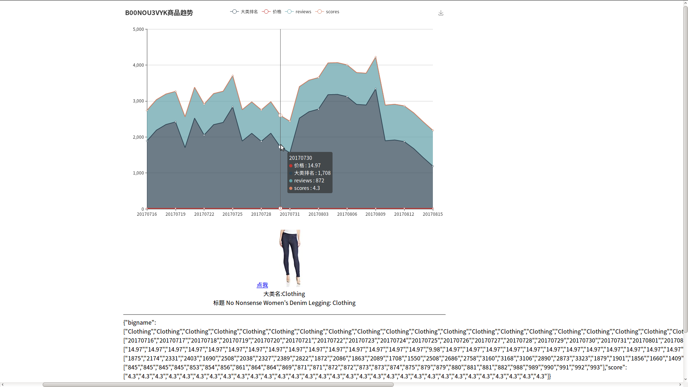

# Full Automatic Amazon Distributed crawler|spider (USA, Japan, Germany and UK)

[](https://github.com/hunterhug/AmazonBigSpider/network)
[](https://github.com/hunterhug/AmazonBigSpider/stargazers)
[](https://github.com/hunterhug/AmazonBigSpider)
[](https://goreportcard.com/report/github.com/hunterhug/AmazonBigSpider)
[](https://github.com/hunterhug/AmazonBigSpider/issues)

## 一. 介绍

1. 2018.06-now| 全新出发，代码全部开源，并且采集端和网站端全部合并在一个仓库。
2. 2017.10-2018.05| 此项目为亚马逊电商带来了过多压力，~~开始局部闭源~~，现在Github上的版本是v2.0，~~闭源版本到达3.0，新的功能和修的新BUG将不再提交Github~~ 
3. 2016.10-2016.12| 第一版Python采集端见:[这个仓库](https://github.com/hunterhug/AmazonPython)，老说明戳[这里](doc/old-readme.md)。

本人不承担该数据采集程序所带来的一切纠纷， 禁止任何机构及个人将此系统作为商业用途！ 本人提供收费服务！

平台具体使用请查看[亚马逊大数据智能选款平台使用手册v1.2.pdf](https://github.com/hunterhug/AmazonBigSpider/raw/master/doc/%E4%BA%9A%E9%A9%AC%E9%80%8A%E5%A4%A7%E6%95%B0%E6%8D%AE%E6%99%BA%E8%83%BD%E9%80%89%E6%AC%BE%E5%B9%B3%E5%8F%B0%E4%BD%BF%E7%94%A8%E6%89%8B%E5%86%8Cv1.2.pdf)。 

### 1. 中文介绍

用途： 选款，特别适合亚马逊跨境电子商务运营公司(不支持中国亚马逊)。核心竞争力： 四个国际站点：`美国/英国/日本/德国`，分布式，配套后台可视化。

关于选款： TOP20W排名商品供你自由选择。

亚马逊爬虫支持：

1. 列表页和详情页可选择代理方式
2. 多浏览器保存cookie机制
3. 机器人检测达到阈值自动换代理
4. 检测日期过期自动停止程序
5. IP池扫描周期填充代理IP
6. 支持分布式跨平台抓取
7. 高并发进程设置抓取
8. 默认网页爬取去重
9. 日志记录功能
10. 配套可视化网站，支持多角度查看数据，小类数据，大类数据，Asin数据和类目数据，支持查看每件Asin商品的历史记录，如排名，价格，打分，reviews变化。部分数据支持导出，且网站支持RBAC权限，可分配每部分数据的查看和使用权限。
11. 网络端监控爬虫，可查看爬虫当前时段数据抓取状态，爬取的进度，IP的消耗程度。   **可支持网络端启动和停止爬虫，彻底成为Saas**（待做）
12. 可自定义填入IP，如塞入其他代理IP网站API获取的IP
13. 可选择HTML文件保存本地

分布式，高并发，跨平台，多站点，多种自定义配置，极强的容错能力是这个爬虫的特点。机器数量和IP代理足够情况下，每天每个站点可满足抓取几百万的商品数据。

如果这个产品有帮助到你,可以抛出请我吃下辣条吗?

微信


支付宝


### 2. 英语介绍

Support UAS/Japan/Germany/UK, Amazing!

Catch the best seller items in Amazon USA! Using redis to store proxy ip and the category url. First fetch items list and then collect many Asin, store in mysql. Items list catch just for the Asin, and we suggest one month or several weeks to fetch list page. We just need fetch the Asin detail page and everything we get!

We keep all Asin in one big table. And if catch detail 404, we set it as not valid. Also we can use API catch big rank but look not so good!

So, there are two ways to get the big rank：

1. catch list page(not proxy), using API get the big rank

2. catch list page(not proxy), and then get asin detail page(proxy), API can not catch all the asin big rank so must use this!

Due to we want list smallrank and the bigrank at the same time, but mysql update is so slow, we make two tables to save, one is smallrank, one is bigrank!

We test a lot,if a ip no stop and more than 500 times http get,the list page will no robot,but the detail asin page will be robot. So we bind a proxy ip with and fix useragent, and keep all cookie. But it still happen, a IP die still can fetch detail page after 26-100times get, It tell us we can still ignore robot, and catch max 100 times we will get that page. robot page is about 7KB.

However, if a lot of request, will be like that 500 error

For reason that the detail page is such large that waste a lot of disk space, we save the list page in the local file and the detail page you can decide whether to save it or not.


## 3. 最新说明

鉴于本人精力有限, 无暇多开发新功能, 有更多需求可来邮. 目前搭了一套[亚马逊电子商务大数据智能平台](http://aws.lenggirl.com/public), 您可以上去观摩, 帐号密码均为`admin`, 切勿破坏, 且行且珍惜. 如果您是一名开发, 您觉得不错, 学习到了知识, 可以扫描下方二维码友情赞助. 如果你是一个电商服务公司的老板, 或者是从业者, 急需使用到该平台来进行选款, 洞察商品变化趋势, 可以来邮咨询, 我提供有偿搭建服务, 价格合理, 完全划得来.

核心的爬虫包也已经拆分成库了，见[Project:Marmot(Tubo) - Golang Web Spider/Crawler/Scrapy Package | 爬虫库](https://github.com/hunterhug/marmot)。网站端也拆分成库了[Project:Rabbit(Tuzi) - Golang Enterprise Web | 简单企业网站](https://github.com/hunterhug/rabbit)

## 4. 版本说明

v2.0

1. 增加安装详细说明
2. 修补一些BUG
3. 美国站类目URL已经更新: /doc/sql/days/usa_category20171026.sql(数据库导入必须是最新的)

v2.3

1. 解决许多BUG

v3.0

1. 添加各种新功能
2. 改BUG

## 5. 可视化端

类目，你可以自行更改抓取页数，是否抓取。


小类数据，基本Top100商品数据。


大类数据，很详细，包括大类排名等，可以复杂查询条件筛选，下载。


产品趋势，你可以看到产品十几天的排名变化，价格变化。



导出的EXCEL


# 四. 欢迎咨询

如果你想咨询或学习，请发邮件或加我QQ: 459527502。

开发这个产品从2016年10月就开始了, 目前迭代从2.0开始.

此项目可以持续优化成功一个更好的平台, 因为国内目前还没有像淘宝数据参谋一样的亚马逊数据参谋. 由于高并发百万级每天导致的数据抓取速度问题, 和数据获取后的清洗和挖掘问题, 我们可以在以下方面做得更好. 

1. 首先数据抓取速度保证和爬虫部署问题, 可以采用`Docker`自动构建, 构建`kubernetes`集群进行`deployments`部署, 自动跨容和缩容爬虫服务, 分布式爬虫不再需要手工上去跑任务.
2. 其次数据保存在`MYSQL`产生的分表问题, 因为`MYSQL`是非分布式的集中式关系型数据库, 大量数据导致数据查找困难, 多表间数据`union`和`join`困难, 所以可以采用`ElasticSearch`来替换`MYSQL`, 著名的`JAVA Nutch搜索引擎框架`使用的就是`ES`.
3. 最后, 关于数据获取后的清洗和挖掘问题, 是属于离线操作问题, 保存在`ES`的数据本身支持各种搜索,`ES`的文本搜索能力超出你的想象, 一般需求可以满足, 不能满足的需求则要从`ES`抽取数据, 构建不同主题的数据仓库进行定制化挖掘. 此部分, 需要开发另外的项目.
4. 配套的`UI`网站端可以有更好的用户体验, 目前基本可以满足选款的需求, 商品的各种数据优美的显示出来.

~~闭源版本增加若干新功能~~，并更新类目，去掉图书，CD和APP，类目大体如下。

```
+----------------------------+-----------------+
| bigpname                   | count(bigpname) |
+----------------------------+-----------------+
| Amazon Launchpad           |              22 |
| Appliances                 |              34 |
| Arts Crafts & Sewing       |             470 |
| Automotive                 |            3162 |
| Baby                       |             333 |
| Beauty & Personal Care     |             406 |
| Camera & Photo             |             214 |
| Cell Phones & Accessories  |              61 |
| Clothing Shoes & Jewelry   |            1803 |
| Collectible Coins          |               3 |
| Computers & Accessories    |             294 |
| Electronics                |            1292 |
| Entertainment Collectibles |              43 |
| Gift Cards                 |              19 |
| Grocery & Gourmet Food     |            1324 |
| Health & Household         |            1185 |
| Home & Kitchen             |            1903 |
| Industrial & Scientific    |            3325 |
| Kitchen & Dining           |             738 |
| Musical Instruments        |             612 |
| Office Products            |             736 |
| Patio Lawn & Garden        |             590 |
| Pet Supplies               |             499 |
| Prime Pantry               |               1 |
| Sports & Outdoors          |            2686 |
| Sports Collectibles        |              57 |
| Tools & Home Improvement   |            1666 |
| Toys & Games               |             791 |
+----------------------------+-----------------+
```

# 免责声明

关于版权，爬虫有风险, 本人不承担由此开源项目带来的任何责任。

```
	版权所有，侵权必究
	署名-非商业性使用-禁止演绎 4.0 国际
	警告： 以下的代码版权归属hunterhug，请不要传播或修改代码
	你可以在教育用途下使用该代码，但是禁止公司或个人用于商业用途(在未授权情况下不得用于盈利)
	商业授权请联系邮箱：gdccmcm14@live.com QQ:459527502

	All right reserved
	Attribution-NonCommercial-NoDerivatives 4.0 International
	Notice: The following code's copyright by hunterhug, Please do not spread and modify.
	You can use it for education only but can't make profits for any companies and individuals!
	For more information on commercial licensing please contact hunterhug.
	Ask for commercial licensing please contact Mail:gdccmcm14@live.com Or QQ:459527502

	2017.7 by hunterhug
```
